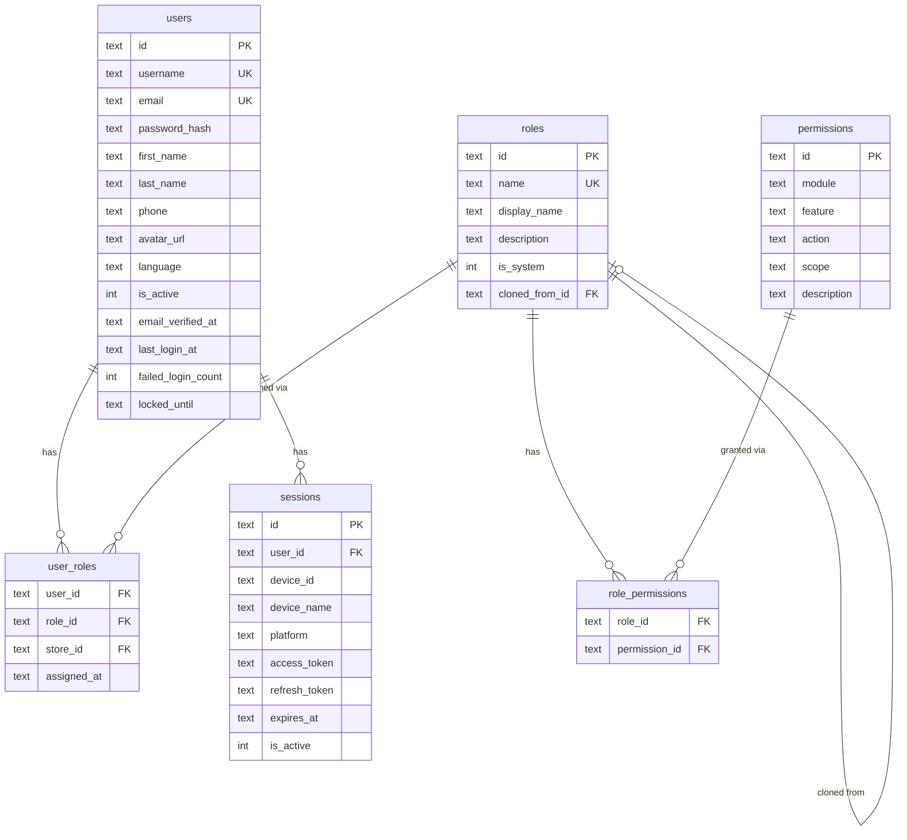
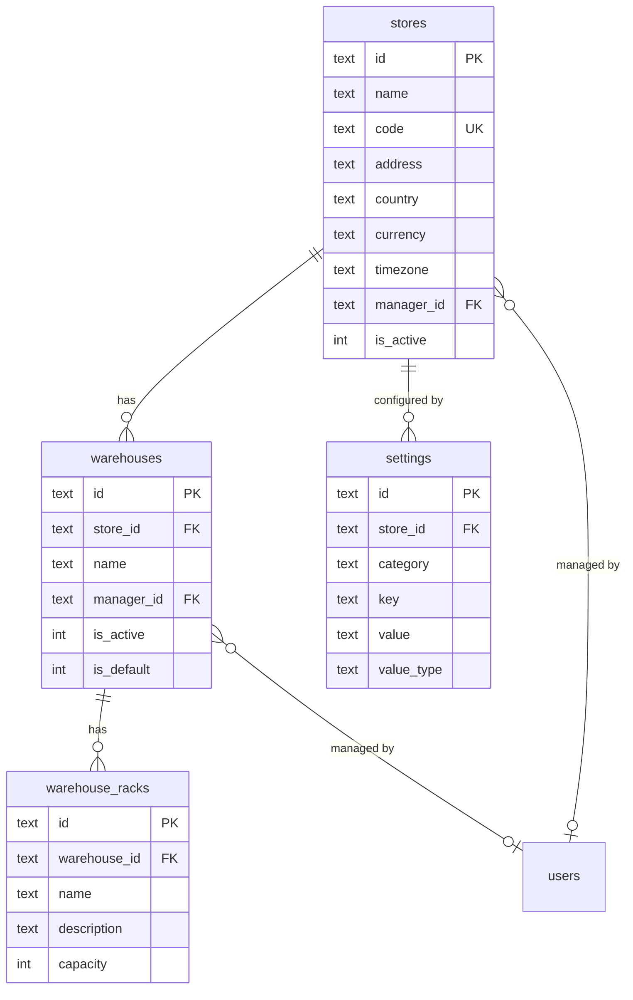
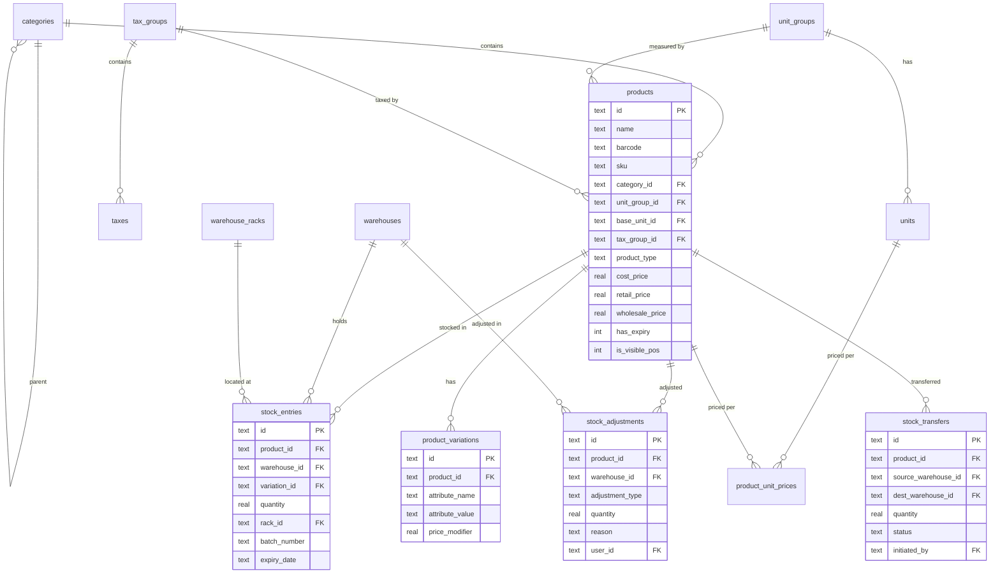
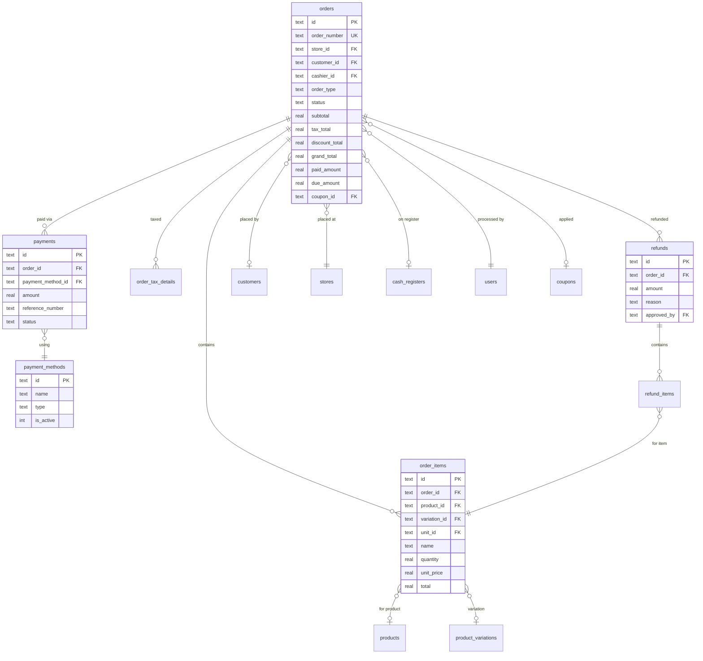
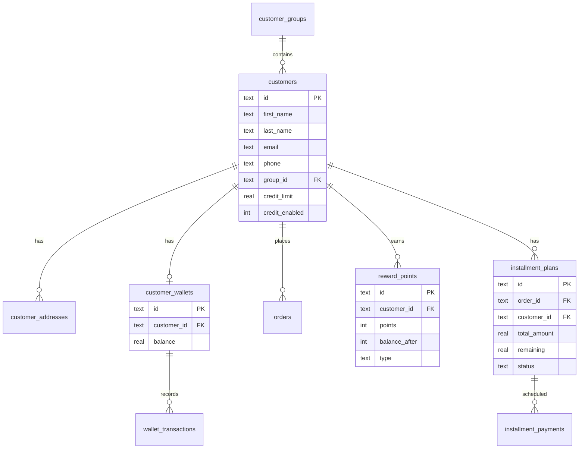

# ZyntaPOS — Enterprise ER Diagram Plan

> **Document ID:** ZENTA-ER-DIAGRAM-v1.0  
> **Status:** APPROVED FOR EXECUTION  
> **Database:** SQLDelight (SQLite local) + PostgreSQL (cloud server)  
> **Encryption:** SQLCipher AES-256 for local storage  
> **Author:** Senior KMP Architect & Lead Engineer  
> **Created:** 2026-02-19  

---

## Table of Contents

1. [ER Diagram Overview](#1-er-diagram-overview)
2. [Entity Domains](#2-entity-domains)
3. [Domain 1: Identity & Access Management](#3-domain-1-identity--access-management)
4. [Domain 2: Store & Infrastructure](#4-domain-2-store--infrastructure)
5. [Domain 3: Product & Inventory](#5-domain-3-product--inventory)
6. [Domain 4: Sales & Orders](#6-domain-4-sales--orders)
7. [Domain 5: Customer Relationship Management](#7-domain-5-customer-relationship-management)
8. [Domain 6: Cash Register & Finance](#8-domain-6-cash-register--finance)
9. [Domain 7: Procurement & Suppliers](#9-domain-7-procurement--suppliers)
10. [Domain 8: Staff & HR](#10-domain-8-staff--hr)
11. [Domain 9: Coupons & Promotions](#11-domain-9-coupons--promotions)
12. [Domain 10: System & Sync](#12-domain-10-system--sync)
13. [Complete ER Diagram (Mermaid)](#13-complete-er-diagram-mermaid)
14. [Index & Column Specifications](#14-index--column-specifications)
15. [Sync & CRDT Metadata](#15-sync--crdt-metadata)
16. [Data Retention & Archival Rules](#16-data-retention--archival-rules)

---

## 1. ER Diagram Overview

### 1.1 Entity Statistics

| Domain | Entity Count | Relationship Count | Phase |
|--------|-------------|-------------------|-------|
| Identity & Access | 6 | 8 | 1 |
| Store & Infrastructure | 4 | 5 | 1 |
| Product & Inventory | 12 | 16 | 1 |
| Sales & Orders | 8 | 12 | 1 |
| CRM | 8 | 10 | 2 |
| Cash Register & Finance | 7 | 9 | 1–2 |
| Procurement & Suppliers | 4 | 5 | 1 |
| Staff & HR | 5 | 6 | 3 |
| Coupons & Promotions | 4 | 5 | 2 |
| System & Sync | 5 | 4 | 1 |
| **TOTAL** | **63** | **80** | — |

### 1.2 Naming Conventions

| Convention | Rule | Example |
|-----------|------|---------|
| Table names | snake_case, plural | `order_items`, `cash_registers` |
| Column names | snake_case | `created_at`, `store_id` |
| Primary keys | `id` (BIGINT/UUID) | `id INTEGER PRIMARY KEY` |
| Foreign keys | `{entity}_id` | `customer_id`, `store_id` |
| Timestamps | `created_at`, `updated_at` | ISO-8601 format |
| Soft delete | `deleted_at` (nullable) | NULL = active |
| Sync fields | `sync_id`, `sync_version`, `sync_status` | UUID, integer, enum |
| Boolean flags | `is_*` or `has_*` | `is_active`, `has_expiry` |
| Enums | stored as TEXT | `'ACTIVE'`, `'PENDING'` |

### 1.3 Base Entity Template

Every entity includes these common columns:

```sql
-- Common columns for ALL entities
id              TEXT PRIMARY KEY,       -- UUID v4
created_at      TEXT NOT NULL,          -- ISO-8601 timestamp
updated_at      TEXT NOT NULL,          -- ISO-8601 timestamp
deleted_at      TEXT,                   -- NULL = active (soft delete)
sync_id         TEXT NOT NULL,          -- UUID for sync identification
sync_version    INTEGER NOT NULL DEFAULT 1,  -- Monotonic version counter
sync_status     TEXT NOT NULL DEFAULT 'PENDING',  -- PENDING|SYNCED|CONFLICT
store_id        TEXT,                   -- NULL for global entities
```

---

## 2. Entity Domains

### High-Level Domain Relationship Map

```
┌──────────────┐     ┌──────────────┐     ┌──────────────┐
│   IDENTITY   │────►│    STORE     │◄────│   SETTINGS   │
│  & ACCESS    │     │  & INFRA     │     │   & CONFIG   │
└──────┬───────┘     └──────┬───────┘     └──────────────┘
       │                    │
       │              ┌─────┴──────┐
       │              ▼            ▼
       │    ┌──────────────┐ ┌──────────────┐
       ├───►│   PRODUCT    │ │    CASH      │
       │    │  & INVENTORY │ │  REGISTER    │
       │    └──────┬───────┘ └──────┬───────┘
       │           │                │
       │     ┌─────┴────┐    ┌─────┴────┐
       │     ▼          ▼    ▼          ▼
       │ ┌────────┐ ┌────────┐  ┌────────────┐
       │ │ SALES  │ │PROCURE-│  │  FINANCE   │
       │ │& ORDERS│ │ MENT   │  │ & EXPENSES │
       │ └───┬────┘ └────────┘  └────────────┘
       │     │
       │     ▼
       │ ┌──────────┐   ┌────────────┐
       ├►│   CRM    │   │  COUPONS   │
       │ │          │◄──│& PROMOTIONS│
       │ └──────────┘   └────────────┘
       │
       └──►┌──────────┐   ┌────────────┐
           │  STAFF   │   │  SYSTEM    │
           │  & HR    │   │  & SYNC    │
           └──────────┘   └────────────┘
```

---

## 3. Domain 1: Identity & Access Management

### 3.1 Entity Definitions

#### `users`
```sql
CREATE TABLE users (
    id                  TEXT PRIMARY KEY,
    username            TEXT NOT NULL UNIQUE,
    email               TEXT NOT NULL UNIQUE,
    password_hash       TEXT NOT NULL,           -- BCrypt hashed
    first_name          TEXT NOT NULL,
    last_name           TEXT NOT NULL,
    phone               TEXT,
    avatar_url          TEXT,
    language            TEXT NOT NULL DEFAULT 'en',
    is_active           INTEGER NOT NULL DEFAULT 1,
    email_verified_at   TEXT,
    last_login_at       TEXT,
    failed_login_count  INTEGER NOT NULL DEFAULT 0,
    locked_until        TEXT,                    -- Account lockout timestamp
    created_at          TEXT NOT NULL,
    updated_at          TEXT NOT NULL,
    deleted_at          TEXT,
    sync_id             TEXT NOT NULL,
    sync_version        INTEGER NOT NULL DEFAULT 1,
    sync_status         TEXT NOT NULL DEFAULT 'PENDING'
);
```

#### `roles`
```sql
CREATE TABLE roles (
    id              TEXT PRIMARY KEY,
    name            TEXT NOT NULL UNIQUE,       -- 'admin', 'store_manager', 'cashier', etc.
    display_name    TEXT NOT NULL,
    description     TEXT,
    is_system       INTEGER NOT NULL DEFAULT 0, -- System roles cannot be deleted
    cloned_from_id  TEXT REFERENCES roles(id),
    created_at      TEXT NOT NULL,
    updated_at      TEXT NOT NULL,
    deleted_at      TEXT,
    sync_id         TEXT NOT NULL,
    sync_version    INTEGER NOT NULL DEFAULT 1,
    sync_status     TEXT NOT NULL DEFAULT 'PENDING'
);
```

#### `permissions`
```sql
CREATE TABLE permissions (
    id          TEXT PRIMARY KEY,
    module      TEXT NOT NULL,                  -- 'pos', 'inventory', 'reports'
    feature     TEXT NOT NULL,                  -- 'order', 'product', 'stock'
    action      TEXT NOT NULL,                  -- 'create', 'read', 'update', 'delete', 'export'
    scope       TEXT NOT NULL DEFAULT 'ALL',    -- 'ALL', 'OWN_STORE', 'OWN'
    description TEXT,
    created_at  TEXT NOT NULL,
    updated_at  TEXT NOT NULL
);
-- Composite unique: module + feature + action + scope
```

#### `role_permissions` (Junction)
```sql
CREATE TABLE role_permissions (
    role_id         TEXT NOT NULL REFERENCES roles(id) ON DELETE CASCADE,
    permission_id   TEXT NOT NULL REFERENCES permissions(id) ON DELETE CASCADE,
    PRIMARY KEY (role_id, permission_id)
);
```

#### `user_roles` (Junction)
```sql
CREATE TABLE user_roles (
    user_id     TEXT NOT NULL REFERENCES users(id) ON DELETE CASCADE,
    role_id     TEXT NOT NULL REFERENCES roles(id) ON DELETE CASCADE,
    store_id    TEXT REFERENCES stores(id),     -- Role can be store-scoped
    assigned_at TEXT NOT NULL,
    PRIMARY KEY (user_id, role_id, store_id)
);
```

#### `sessions`
```sql
CREATE TABLE sessions (
    id              TEXT PRIMARY KEY,
    user_id         TEXT NOT NULL REFERENCES users(id) ON DELETE CASCADE,
    device_id       TEXT NOT NULL,              -- Device fingerprint
    device_name     TEXT,
    platform        TEXT NOT NULL,              -- 'ANDROID', 'DESKTOP_WIN', 'DESKTOP_MAC', 'DESKTOP_LINUX'
    access_token    TEXT NOT NULL,              -- JWT access token (encrypted at rest)
    refresh_token   TEXT NOT NULL,              -- JWT refresh token (encrypted at rest)
    ip_address      TEXT,
    expires_at      TEXT NOT NULL,
    last_activity   TEXT NOT NULL,
    is_active       INTEGER NOT NULL DEFAULT 1,
    created_at      TEXT NOT NULL,
    updated_at      TEXT NOT NULL
);
```

### 3.2 Domain 1 ER Diagram



---

## 4. Domain 2: Store & Infrastructure

### 4.1 Entity Definitions

#### `stores`
```sql
CREATE TABLE stores (
    id              TEXT PRIMARY KEY,
    name            TEXT NOT NULL,
    code            TEXT NOT NULL UNIQUE,       -- Short code: 'STORE-001'
    address         TEXT,
    city            TEXT,
    state           TEXT,
    country         TEXT NOT NULL DEFAULT 'LK', -- ISO country code
    postal_code     TEXT,
    phone           TEXT,
    email           TEXT,
    logo_url        TEXT,
    tax_id          TEXT,                       -- Tax registration number
    currency        TEXT NOT NULL DEFAULT 'LKR',
    timezone        TEXT NOT NULL DEFAULT 'Asia/Colombo',
    manager_id      TEXT REFERENCES users(id),
    is_active       INTEGER NOT NULL DEFAULT 1,
    created_at      TEXT NOT NULL,
    updated_at      TEXT NOT NULL,
    deleted_at      TEXT,
    sync_id         TEXT NOT NULL,
    sync_version    INTEGER NOT NULL DEFAULT 1,
    sync_status     TEXT NOT NULL DEFAULT 'PENDING'
);
```

#### `warehouses`
```sql
CREATE TABLE warehouses (
    id          TEXT PRIMARY KEY,
    store_id    TEXT NOT NULL REFERENCES stores(id),
    name        TEXT NOT NULL,
    address     TEXT,
    manager_id  TEXT REFERENCES users(id),
    is_active   INTEGER NOT NULL DEFAULT 1,
    is_default  INTEGER NOT NULL DEFAULT 0,
    created_at  TEXT NOT NULL,
    updated_at  TEXT NOT NULL,
    deleted_at  TEXT,
    sync_id     TEXT NOT NULL,
    sync_version INTEGER NOT NULL DEFAULT 1,
    sync_status TEXT NOT NULL DEFAULT 'PENDING'
);
```

#### `warehouse_racks`
```sql
CREATE TABLE warehouse_racks (
    id              TEXT PRIMARY KEY,
    warehouse_id    TEXT NOT NULL REFERENCES warehouses(id),
    name            TEXT NOT NULL,              -- 'A1', 'B3-Shelf-2'
    description     TEXT,
    capacity        INTEGER,
    created_at      TEXT NOT NULL,
    updated_at      TEXT NOT NULL,
    deleted_at      TEXT,
    sync_id         TEXT NOT NULL,
    sync_version    INTEGER NOT NULL DEFAULT 1,
    sync_status     TEXT NOT NULL DEFAULT 'PENDING'
);
```

#### `settings`
```sql
CREATE TABLE settings (
    id          TEXT PRIMARY KEY,
    store_id    TEXT REFERENCES stores(id),     -- NULL = global setting
    category    TEXT NOT NULL,                  -- 'general', 'pos', 'tax', 'payment', 'printing'
    key         TEXT NOT NULL,                  -- 'receipt_auto_print', 'default_tax_group'
    value       TEXT NOT NULL,                  -- JSON-encoded value
    value_type  TEXT NOT NULL DEFAULT 'STRING', -- 'STRING', 'INTEGER', 'BOOLEAN', 'JSON'
    created_at  TEXT NOT NULL,
    updated_at  TEXT NOT NULL,
    sync_id     TEXT NOT NULL,
    sync_version INTEGER NOT NULL DEFAULT 1,
    sync_status TEXT NOT NULL DEFAULT 'PENDING',
    UNIQUE(store_id, category, key)
);
```

### 4.2 Domain 2 ER Diagram



---

## 5. Domain 3: Product & Inventory

### 5.1 Entity Definitions

#### `categories`
```sql
CREATE TABLE categories (
    id              TEXT PRIMARY KEY,
    parent_id       TEXT REFERENCES categories(id), -- Self-referencing hierarchy
    name            TEXT NOT NULL,
    description     TEXT,
    image_url       TEXT,
    display_order   INTEGER NOT NULL DEFAULT 0,
    is_active       INTEGER NOT NULL DEFAULT 1,
    created_at      TEXT NOT NULL,
    updated_at      TEXT NOT NULL,
    deleted_at      TEXT,
    sync_id         TEXT NOT NULL,
    sync_version    INTEGER NOT NULL DEFAULT 1,
    sync_status     TEXT NOT NULL DEFAULT 'PENDING'
);
```

#### `unit_groups`
```sql
CREATE TABLE unit_groups (
    id          TEXT PRIMARY KEY,
    name        TEXT NOT NULL,                 -- 'Weight', 'Volume', 'Length', 'Count'
    description TEXT,
    created_at  TEXT NOT NULL,
    updated_at  TEXT NOT NULL,
    deleted_at  TEXT,
    sync_id     TEXT NOT NULL,
    sync_version INTEGER NOT NULL DEFAULT 1,
    sync_status TEXT NOT NULL DEFAULT 'PENDING'
);
```

#### `units`
```sql
CREATE TABLE units (
    id              TEXT PRIMARY KEY,
    unit_group_id   TEXT NOT NULL REFERENCES unit_groups(id),
    name            TEXT NOT NULL,             -- 'Kilogram', 'Piece', 'Liter'
    abbreviation    TEXT NOT NULL,             -- 'kg', 'pcs', 'L'
    conversion_factor REAL NOT NULL DEFAULT 1.0, -- Relative to base unit
    is_base_unit    INTEGER NOT NULL DEFAULT 0,
    description     TEXT,
    created_at      TEXT NOT NULL,
    updated_at      TEXT NOT NULL,
    deleted_at      TEXT,
    sync_id         TEXT NOT NULL,
    sync_version    INTEGER NOT NULL DEFAULT 1,
    sync_status     TEXT NOT NULL DEFAULT 'PENDING'
);
```

#### `tax_groups`
```sql
CREATE TABLE tax_groups (
    id          TEXT PRIMARY KEY,
    name        TEXT NOT NULL,                 -- 'Standard VAT', 'Reduced Rate'
    description TEXT,
    is_active   INTEGER NOT NULL DEFAULT 1,
    created_at  TEXT NOT NULL,
    updated_at  TEXT NOT NULL,
    deleted_at  TEXT,
    sync_id     TEXT NOT NULL,
    sync_version INTEGER NOT NULL DEFAULT 1,
    sync_status TEXT NOT NULL DEFAULT 'PENDING'
);
```

#### `taxes`
```sql
CREATE TABLE taxes (
    id              TEXT PRIMARY KEY,
    tax_group_id    TEXT NOT NULL REFERENCES tax_groups(id),
    name            TEXT NOT NULL,             -- 'VAT', 'Service Tax', 'Luxury Tax'
    rate            REAL NOT NULL,             -- 15.0 = 15%
    computation     TEXT NOT NULL DEFAULT 'PERCENTAGE', -- 'PERCENTAGE', 'FIXED'
    is_inclusive    INTEGER NOT NULL DEFAULT 0, -- Tax included in price?
    created_at      TEXT NOT NULL,
    updated_at      TEXT NOT NULL,
    deleted_at      TEXT,
    sync_id         TEXT NOT NULL,
    sync_version    INTEGER NOT NULL DEFAULT 1,
    sync_status     TEXT NOT NULL DEFAULT 'PENDING'
);
```

#### `products`
```sql
CREATE TABLE products (
    id                  TEXT PRIMARY KEY,
    name                TEXT NOT NULL,
    barcode             TEXT,                  -- EAN-13, Code128, etc.
    barcode_type        TEXT DEFAULT 'EAN13',  -- 'EAN13', 'CODE128', 'QR', etc.
    sku                 TEXT,                  -- Internal product code
    category_id         TEXT REFERENCES categories(id),
    unit_group_id       TEXT REFERENCES unit_groups(id),
    base_unit_id        TEXT REFERENCES units(id),
    tax_group_id        TEXT REFERENCES tax_groups(id),
    product_type        TEXT NOT NULL DEFAULT 'STOCKABLE', -- 'STOCKABLE', 'NON_STOCKABLE', 'SERVICE'
    description         TEXT,
    cost_price          REAL NOT NULL DEFAULT 0.0,  -- COGS
    retail_price        REAL NOT NULL DEFAULT 0.0,  -- Normal selling price
    wholesale_price     REAL,
    has_expiry          INTEGER NOT NULL DEFAULT 0,
    expiry_date         TEXT,
    prevent_expired_sale INTEGER NOT NULL DEFAULT 1,
    low_stock_threshold INTEGER DEFAULT 10,
    stock_alert_enabled INTEGER NOT NULL DEFAULT 1,
    image_url           TEXT,
    gallery_urls        TEXT,                  -- JSON array of URLs
    is_visible_pos      INTEGER NOT NULL DEFAULT 1,
    is_archived         INTEGER NOT NULL DEFAULT 0,
    store_id            TEXT REFERENCES stores(id), -- NULL = available in all stores
    created_at          TEXT NOT NULL,
    updated_at          TEXT NOT NULL,
    deleted_at          TEXT,
    sync_id             TEXT NOT NULL,
    sync_version        INTEGER NOT NULL DEFAULT 1,
    sync_status         TEXT NOT NULL DEFAULT 'PENDING'
);

CREATE INDEX idx_products_barcode ON products(barcode);
CREATE INDEX idx_products_sku ON products(sku);
CREATE INDEX idx_products_category ON products(category_id);
CREATE INDEX idx_products_name ON products(name);
```

#### `product_variations`
```sql
CREATE TABLE product_variations (
    id              TEXT PRIMARY KEY,
    product_id      TEXT NOT NULL REFERENCES products(id) ON DELETE CASCADE,
    name            TEXT NOT NULL,             -- 'Large Red', 'Small Blue'
    sku             TEXT,
    barcode         TEXT,
    attribute_name  TEXT NOT NULL,             -- 'Size', 'Color', 'Weight'
    attribute_value TEXT NOT NULL,             -- 'Large', 'Red', '500g'
    price_modifier  REAL NOT NULL DEFAULT 0.0, -- Added/subtracted from base price
    cost_modifier   REAL NOT NULL DEFAULT 0.0,
    image_url       TEXT,
    is_active       INTEGER NOT NULL DEFAULT 1,
    created_at      TEXT NOT NULL,
    updated_at      TEXT NOT NULL,
    deleted_at      TEXT,
    sync_id         TEXT NOT NULL,
    sync_version    INTEGER NOT NULL DEFAULT 1,
    sync_status     TEXT NOT NULL DEFAULT 'PENDING'
);
```

#### `product_unit_prices` (Unit-specific pricing)
```sql
CREATE TABLE product_unit_prices (
    id          TEXT PRIMARY KEY,
    product_id  TEXT NOT NULL REFERENCES products(id) ON DELETE CASCADE,
    unit_id     TEXT NOT NULL REFERENCES units(id),
    price       REAL NOT NULL,
    cost_price  REAL,
    created_at  TEXT NOT NULL,
    updated_at  TEXT NOT NULL,
    sync_id     TEXT NOT NULL,
    sync_version INTEGER NOT NULL DEFAULT 1,
    sync_status TEXT NOT NULL DEFAULT 'PENDING',
    UNIQUE(product_id, unit_id)
);
```

#### `stock_entries`
```sql
CREATE TABLE stock_entries (
    id              TEXT PRIMARY KEY,
    product_id      TEXT NOT NULL REFERENCES products(id),
    warehouse_id    TEXT NOT NULL REFERENCES warehouses(id),
    variation_id    TEXT REFERENCES product_variations(id),
    quantity        REAL NOT NULL DEFAULT 0.0,  -- Current stock level
    rack_id         TEXT REFERENCES warehouse_racks(id),
    batch_number    TEXT,
    expiry_date     TEXT,
    created_at      TEXT NOT NULL,
    updated_at      TEXT NOT NULL,
    sync_id         TEXT NOT NULL,
    sync_version    INTEGER NOT NULL DEFAULT 1,
    sync_status     TEXT NOT NULL DEFAULT 'PENDING',
    UNIQUE(product_id, warehouse_id, variation_id, batch_number)
);
```

#### `stock_adjustments`
```sql
CREATE TABLE stock_adjustments (
    id              TEXT PRIMARY KEY,
    product_id      TEXT NOT NULL REFERENCES products(id),
    warehouse_id    TEXT NOT NULL REFERENCES warehouses(id),
    variation_id    TEXT REFERENCES product_variations(id),
    adjustment_type TEXT NOT NULL,              -- 'INCREASE', 'DECREASE', 'RECONCILIATION'
    quantity        REAL NOT NULL,              -- Positive for increase, negative for decrease
    previous_qty    REAL NOT NULL,
    new_qty         REAL NOT NULL,
    reason          TEXT,
    user_id         TEXT NOT NULL REFERENCES users(id),
    created_at      TEXT NOT NULL,
    sync_id         TEXT NOT NULL,
    sync_version    INTEGER NOT NULL DEFAULT 1,
    sync_status     TEXT NOT NULL DEFAULT 'PENDING'
);
```

#### `stock_transfers`
```sql
CREATE TABLE stock_transfers (
    id                      TEXT PRIMARY KEY,
    product_id              TEXT NOT NULL REFERENCES products(id),
    source_warehouse_id     TEXT NOT NULL REFERENCES warehouses(id),
    dest_warehouse_id       TEXT NOT NULL REFERENCES warehouses(id),
    variation_id            TEXT REFERENCES product_variations(id),
    quantity                REAL NOT NULL,
    status                  TEXT NOT NULL DEFAULT 'PENDING', -- 'PENDING', 'IN_TRANSIT', 'COMPLETED', 'CANCELLED'
    initiated_by            TEXT NOT NULL REFERENCES users(id),
    completed_at            TEXT,
    notes                   TEXT,
    created_at              TEXT NOT NULL,
    updated_at              TEXT NOT NULL,
    sync_id                 TEXT NOT NULL,
    sync_version            INTEGER NOT NULL DEFAULT 1,
    sync_status             TEXT NOT NULL DEFAULT 'PENDING'
);
```

### 5.2 Domain 3 ER Diagram



---

## 6. Domain 4: Sales & Orders

### 6.1 Entity Definitions

#### `orders`
```sql
CREATE TABLE orders (
    id                  TEXT PRIMARY KEY,
    order_number        TEXT NOT NULL UNIQUE,   -- 'ORD-2026-00001'
    store_id            TEXT NOT NULL REFERENCES stores(id),
    register_id         TEXT REFERENCES cash_registers(id),
    session_id          TEXT REFERENCES register_sessions(id),
    customer_id         TEXT REFERENCES customers(id),
    cashier_id          TEXT NOT NULL REFERENCES users(id),
    order_type          TEXT NOT NULL DEFAULT 'TAKEAWAY', -- 'TAKEAWAY', 'DELIVERY', 'DINE_IN', 'QUOTE'
    status              TEXT NOT NULL DEFAULT 'PENDING',  -- 'PENDING', 'COMPLETED', 'HELD', 'CANCELLED', 'VOIDED', 'REFUNDED'
    subtotal            REAL NOT NULL DEFAULT 0.0,
    tax_total           REAL NOT NULL DEFAULT 0.0,
    discount_total      REAL NOT NULL DEFAULT 0.0,
    shipping_fee        REAL NOT NULL DEFAULT 0.0,
    service_charge      REAL NOT NULL DEFAULT 0.0,
    tip_amount          REAL NOT NULL DEFAULT 0.0,
    grand_total         REAL NOT NULL DEFAULT 0.0,
    paid_amount         REAL NOT NULL DEFAULT 0.0,
    change_amount       REAL NOT NULL DEFAULT 0.0,
    due_amount          REAL NOT NULL DEFAULT 0.0,
    discount_type       TEXT,                   -- 'FLAT', 'PERCENTAGE'
    discount_value      REAL DEFAULT 0.0,
    discount_approved_by TEXT REFERENCES users(id), -- Manager approval for large discounts
    coupon_id           TEXT REFERENCES coupons(id),
    order_name          TEXT,                   -- Custom order name
    order_date          TEXT NOT NULL,          -- Can be backdated
    reference_number    TEXT,
    internal_notes      TEXT,
    customer_notes      TEXT,
    print_notes         INTEGER NOT NULL DEFAULT 0,
    shipping_address    TEXT,                   -- JSON: {line1, line2, city, ...}
    delivery_date       TEXT,
    delivery_time       TEXT,
    voided_at           TEXT,
    voided_by           TEXT REFERENCES users(id),
    void_reason         TEXT,
    created_at          TEXT NOT NULL,
    updated_at          TEXT NOT NULL,
    deleted_at          TEXT,
    sync_id             TEXT NOT NULL,
    sync_version        INTEGER NOT NULL DEFAULT 1,
    sync_status         TEXT NOT NULL DEFAULT 'PENDING'
);

CREATE INDEX idx_orders_store ON orders(store_id);
CREATE INDEX idx_orders_customer ON orders(customer_id);
CREATE INDEX idx_orders_date ON orders(order_date);
CREATE INDEX idx_orders_status ON orders(status);
CREATE INDEX idx_orders_number ON orders(order_number);
```

#### `order_items`
```sql
CREATE TABLE order_items (
    id              TEXT PRIMARY KEY,
    order_id        TEXT NOT NULL REFERENCES orders(id) ON DELETE CASCADE,
    product_id      TEXT REFERENCES products(id),
    variation_id    TEXT REFERENCES product_variations(id),
    unit_id         TEXT REFERENCES units(id),
    name            TEXT NOT NULL,             -- Snapshot at time of sale
    sku             TEXT,
    barcode         TEXT,
    quantity        REAL NOT NULL,
    unit_price      REAL NOT NULL,             -- Price per unit at time of sale
    cost_price      REAL NOT NULL DEFAULT 0.0, -- COGS snapshot
    subtotal        REAL NOT NULL,
    discount_type   TEXT,                      -- 'FLAT', 'PERCENTAGE'
    discount_value  REAL DEFAULT 0.0,
    discount_amount REAL NOT NULL DEFAULT 0.0,
    tax_amount      REAL NOT NULL DEFAULT 0.0,
    tax_rate        REAL DEFAULT 0.0,
    total           REAL NOT NULL,
    notes           TEXT,                      -- Item-specific notes
    is_quick_product INTEGER NOT NULL DEFAULT 0, -- Non-inventory item
    created_at      TEXT NOT NULL,
    updated_at      TEXT NOT NULL,
    sync_id         TEXT NOT NULL,
    sync_version    INTEGER NOT NULL DEFAULT 1,
    sync_status     TEXT NOT NULL DEFAULT 'PENDING'
);

CREATE INDEX idx_order_items_order ON order_items(order_id);
CREATE INDEX idx_order_items_product ON order_items(product_id);
```

#### `payments`
```sql
CREATE TABLE payments (
    id                  TEXT PRIMARY KEY,
    order_id            TEXT NOT NULL REFERENCES orders(id),
    payment_method_id   TEXT NOT NULL REFERENCES payment_methods(id),
    amount              REAL NOT NULL,
    reference_number    TEXT,                   -- Card auth code, transfer ref, etc.
    status              TEXT NOT NULL DEFAULT 'COMPLETED', -- 'COMPLETED', 'PENDING', 'FAILED', 'REFUNDED'
    gateway_response    TEXT,                   -- JSON: gateway-specific response data
    paid_at             TEXT NOT NULL,
    created_at          TEXT NOT NULL,
    updated_at          TEXT NOT NULL,
    sync_id             TEXT NOT NULL,
    sync_version        INTEGER NOT NULL DEFAULT 1,
    sync_status         TEXT NOT NULL DEFAULT 'PENDING'
);

CREATE INDEX idx_payments_order ON payments(order_id);
```

#### `payment_methods`
```sql
CREATE TABLE payment_methods (
    id              TEXT PRIMARY KEY,
    name            TEXT NOT NULL,             -- 'Cash', 'Visa/MasterCard', 'FriMi', 'Bank Transfer'
    type            TEXT NOT NULL,             -- 'CASH', 'CARD', 'MOBILE', 'BANK_TRANSFER', 'CUSTOMER_CREDIT'
    is_active       INTEGER NOT NULL DEFAULT 1,
    requires_reference INTEGER NOT NULL DEFAULT 0,
    gateway_config  TEXT,                      -- JSON: payment gateway configuration
    icon_name       TEXT,
    display_order   INTEGER NOT NULL DEFAULT 0,
    store_id        TEXT REFERENCES stores(id), -- NULL = available everywhere
    created_at      TEXT NOT NULL,
    updated_at      TEXT NOT NULL,
    deleted_at      TEXT,
    sync_id         TEXT NOT NULL,
    sync_version    INTEGER NOT NULL DEFAULT 1,
    sync_status     TEXT NOT NULL DEFAULT 'PENDING'
);
```

#### `order_tax_details`
```sql
CREATE TABLE order_tax_details (
    id          TEXT PRIMARY KEY,
    order_id    TEXT NOT NULL REFERENCES orders(id) ON DELETE CASCADE,
    tax_id      TEXT NOT NULL REFERENCES taxes(id),
    tax_name    TEXT NOT NULL,                  -- Snapshot
    tax_rate    REAL NOT NULL,                  -- Snapshot
    taxable_amount REAL NOT NULL,
    tax_amount  REAL NOT NULL,
    created_at  TEXT NOT NULL,
    sync_id     TEXT NOT NULL,
    sync_version INTEGER NOT NULL DEFAULT 1,
    sync_status TEXT NOT NULL DEFAULT 'PENDING'
);
```

#### `refunds`
```sql
CREATE TABLE refunds (
    id              TEXT PRIMARY KEY,
    order_id        TEXT NOT NULL REFERENCES orders(id),
    amount          REAL NOT NULL,
    reason          TEXT NOT NULL,
    refund_method   TEXT NOT NULL,              -- 'CASH', 'ORIGINAL_METHOD', 'STORE_CREDIT'
    status          TEXT NOT NULL DEFAULT 'COMPLETED',
    approved_by     TEXT NOT NULL REFERENCES users(id),
    created_at      TEXT NOT NULL,
    sync_id         TEXT NOT NULL,
    sync_version    INTEGER NOT NULL DEFAULT 1,
    sync_status     TEXT NOT NULL DEFAULT 'PENDING'
);
```

#### `refund_items`
```sql
CREATE TABLE refund_items (
    id              TEXT PRIMARY KEY,
    refund_id       TEXT NOT NULL REFERENCES refunds(id) ON DELETE CASCADE,
    order_item_id   TEXT NOT NULL REFERENCES order_items(id),
    quantity        REAL NOT NULL,
    amount          REAL NOT NULL,
    restock         INTEGER NOT NULL DEFAULT 1, -- Return to inventory?
    created_at      TEXT NOT NULL
);
```

#### `held_carts` (Temporary held orders)
```sql
CREATE TABLE held_carts (
    id              TEXT PRIMARY KEY,
    store_id        TEXT NOT NULL REFERENCES stores(id),
    register_id     TEXT REFERENCES cash_registers(id),
    cashier_id      TEXT NOT NULL REFERENCES users(id),
    customer_id     TEXT REFERENCES customers(id),
    cart_data       TEXT NOT NULL,              -- JSON: full cart state
    notes           TEXT,
    held_at         TEXT NOT NULL,
    expires_at      TEXT,
    created_at      TEXT NOT NULL,
    updated_at      TEXT NOT NULL,
    sync_id         TEXT NOT NULL,
    sync_version    INTEGER NOT NULL DEFAULT 1,
    sync_status     TEXT NOT NULL DEFAULT 'PENDING'
);
```

### 6.2 Domain 4 ER Diagram



---

## 7. Domain 5: Customer Relationship Management

### 7.1 Entity Definitions

#### `customer_groups`
```sql
CREATE TABLE customer_groups (
    id              TEXT PRIMARY KEY,
    name            TEXT NOT NULL,
    description     TEXT,
    discount_type   TEXT,                      -- 'FLAT', 'PERCENTAGE'
    discount_value  REAL DEFAULT 0.0,
    price_type      TEXT DEFAULT 'RETAIL',     -- 'RETAIL', 'WHOLESALE', 'CUSTOM'
    created_at      TEXT NOT NULL,
    updated_at      TEXT NOT NULL,
    deleted_at      TEXT,
    sync_id         TEXT NOT NULL,
    sync_version    INTEGER NOT NULL DEFAULT 1,
    sync_status     TEXT NOT NULL DEFAULT 'PENDING'
);
```

#### `customers`
```sql
CREATE TABLE customers (
    id                  TEXT PRIMARY KEY,
    first_name          TEXT NOT NULL,
    last_name           TEXT,
    email               TEXT,
    phone               TEXT,
    gender              TEXT,                  -- 'MALE', 'FEMALE', 'OTHER'
    birthday            TEXT,
    group_id            TEXT REFERENCES customer_groups(id),
    credit_limit        REAL NOT NULL DEFAULT 0.0,
    credit_enabled      INTEGER NOT NULL DEFAULT 0,
    notes               TEXT,
    is_walk_in          INTEGER NOT NULL DEFAULT 0,
    store_id            TEXT REFERENCES stores(id), -- NULL = global customer
    created_at          TEXT NOT NULL,
    updated_at          TEXT NOT NULL,
    deleted_at          TEXT,
    sync_id             TEXT NOT NULL,
    sync_version        INTEGER NOT NULL DEFAULT 1,
    sync_status         TEXT NOT NULL DEFAULT 'PENDING'
);

CREATE INDEX idx_customers_phone ON customers(phone);
CREATE INDEX idx_customers_email ON customers(email);
CREATE INDEX idx_customers_name ON customers(first_name, last_name);
```

#### `customer_addresses`
```sql
CREATE TABLE customer_addresses (
    id              TEXT PRIMARY KEY,
    customer_id     TEXT NOT NULL REFERENCES customers(id) ON DELETE CASCADE,
    label           TEXT NOT NULL DEFAULT 'Home', -- 'Home', 'Work', 'Other'
    address_line1   TEXT NOT NULL,
    address_line2   TEXT,
    city            TEXT,
    state           TEXT,
    postal_code     TEXT,
    country         TEXT NOT NULL DEFAULT 'LK',
    is_default      INTEGER NOT NULL DEFAULT 0,
    created_at      TEXT NOT NULL,
    updated_at      TEXT NOT NULL,
    sync_id         TEXT NOT NULL,
    sync_version    INTEGER NOT NULL DEFAULT 1,
    sync_status     TEXT NOT NULL DEFAULT 'PENDING'
);
```

#### `customer_wallets`
```sql
CREATE TABLE customer_wallets (
    id              TEXT PRIMARY KEY,
    customer_id     TEXT NOT NULL UNIQUE REFERENCES customers(id),
    balance         REAL NOT NULL DEFAULT 0.0,
    created_at      TEXT NOT NULL,
    updated_at      TEXT NOT NULL,
    sync_id         TEXT NOT NULL,
    sync_version    INTEGER NOT NULL DEFAULT 1,
    sync_status     TEXT NOT NULL DEFAULT 'PENDING'
);
```

#### `wallet_transactions`
```sql
CREATE TABLE wallet_transactions (
    id              TEXT PRIMARY KEY,
    wallet_id       TEXT NOT NULL REFERENCES customer_wallets(id),
    type            TEXT NOT NULL,             -- 'CREDIT', 'DEBIT', 'REFUND'
    amount          REAL NOT NULL,
    balance_after   REAL NOT NULL,
    reference_type  TEXT,                      -- 'ORDER', 'MANUAL', 'REFUND'
    reference_id    TEXT,                      -- order_id or adjustment_id
    description     TEXT,
    created_by      TEXT NOT NULL REFERENCES users(id),
    created_at      TEXT NOT NULL,
    sync_id         TEXT NOT NULL,
    sync_version    INTEGER NOT NULL DEFAULT 1,
    sync_status     TEXT NOT NULL DEFAULT 'PENDING'
);
```

#### `installment_plans`
```sql
CREATE TABLE installment_plans (
    id              TEXT PRIMARY KEY,
    order_id        TEXT NOT NULL REFERENCES orders(id),
    customer_id     TEXT NOT NULL REFERENCES customers(id),
    total_amount    REAL NOT NULL,
    paid_amount     REAL NOT NULL DEFAULT 0.0,
    remaining       REAL NOT NULL,
    num_installments INTEGER NOT NULL,
    frequency       TEXT NOT NULL DEFAULT 'MONTHLY', -- 'WEEKLY', 'BIWEEKLY', 'MONTHLY'
    start_date      TEXT NOT NULL,
    status          TEXT NOT NULL DEFAULT 'ACTIVE',  -- 'ACTIVE', 'COMPLETED', 'DEFAULTED'
    created_at      TEXT NOT NULL,
    updated_at      TEXT NOT NULL,
    sync_id         TEXT NOT NULL,
    sync_version    INTEGER NOT NULL DEFAULT 1,
    sync_status     TEXT NOT NULL DEFAULT 'PENDING'
);
```

#### `installment_payments`
```sql
CREATE TABLE installment_payments (
    id              TEXT PRIMARY KEY,
    plan_id         TEXT NOT NULL REFERENCES installment_plans(id),
    due_date        TEXT NOT NULL,
    amount          REAL NOT NULL,
    paid_amount     REAL NOT NULL DEFAULT 0.0,
    paid_at         TEXT,
    status          TEXT NOT NULL DEFAULT 'PENDING', -- 'PENDING', 'PAID', 'OVERDUE', 'PARTIAL'
    payment_id      TEXT REFERENCES payments(id),
    created_at      TEXT NOT NULL,
    updated_at      TEXT NOT NULL,
    sync_id         TEXT NOT NULL,
    sync_version    INTEGER NOT NULL DEFAULT 1,
    sync_status     TEXT NOT NULL DEFAULT 'PENDING'
);
```

#### `reward_points`
```sql
CREATE TABLE reward_points (
    id              TEXT PRIMARY KEY,
    customer_id     TEXT NOT NULL REFERENCES customers(id),
    points          INTEGER NOT NULL,          -- Positive = earned, negative = redeemed
    balance_after   INTEGER NOT NULL,
    type            TEXT NOT NULL,             -- 'EARNED', 'REDEEMED', 'EXPIRED', 'ADJUSTED'
    reference_type  TEXT,                      -- 'ORDER', 'MANUAL', 'PROMOTION'
    reference_id    TEXT,
    description     TEXT,
    expires_at      TEXT,
    created_at      TEXT NOT NULL,
    sync_id         TEXT NOT NULL,
    sync_version    INTEGER NOT NULL DEFAULT 1,
    sync_status     TEXT NOT NULL DEFAULT 'PENDING'
);

CREATE INDEX idx_reward_points_customer ON reward_points(customer_id);
```

#### `loyalty_tiers`
```sql
CREATE TABLE loyalty_tiers (
    id              TEXT PRIMARY KEY,
    name            TEXT NOT NULL,             -- 'Bronze', 'Silver', 'Gold', 'Platinum'
    min_points      INTEGER NOT NULL,          -- Points needed to reach tier
    discount_percent REAL DEFAULT 0.0,
    points_multiplier REAL NOT NULL DEFAULT 1.0,
    benefits        TEXT,                      -- JSON: list of benefits
    display_order   INTEGER NOT NULL DEFAULT 0,
    created_at      TEXT NOT NULL,
    updated_at      TEXT NOT NULL,
    sync_id         TEXT NOT NULL,
    sync_version    INTEGER NOT NULL DEFAULT 1,
    sync_status     TEXT NOT NULL DEFAULT 'PENDING'
);
```

### 7.2 Domain 5 ER Diagram



---

## 8. Domain 6: Cash Register & Finance

### 8.1 Entity Definitions

#### `cash_registers`
```sql
CREATE TABLE cash_registers (
    id          TEXT PRIMARY KEY,
    store_id    TEXT NOT NULL REFERENCES stores(id),
    name        TEXT NOT NULL,
    status      TEXT NOT NULL DEFAULT 'CLOSED', -- 'OPEN', 'CLOSED'
    is_active   INTEGER NOT NULL DEFAULT 1,
    created_at  TEXT NOT NULL,
    updated_at  TEXT NOT NULL,
    deleted_at  TEXT,
    sync_id     TEXT NOT NULL,
    sync_version INTEGER NOT NULL DEFAULT 1,
    sync_status TEXT NOT NULL DEFAULT 'PENDING'
);
```

#### `register_sessions`
```sql
CREATE TABLE register_sessions (
    id                  TEXT PRIMARY KEY,
    register_id         TEXT NOT NULL REFERENCES cash_registers(id),
    user_id             TEXT NOT NULL REFERENCES users(id),
    opening_balance     REAL NOT NULL DEFAULT 0.0,
    closing_balance     REAL,
    expected_balance    REAL,
    discrepancy         REAL,
    total_sales         REAL NOT NULL DEFAULT 0.0,
    total_refunds       REAL NOT NULL DEFAULT 0.0,
    total_cash_in       REAL NOT NULL DEFAULT 0.0,
    total_cash_out      REAL NOT NULL DEFAULT 0.0,
    opening_notes       TEXT,
    closing_notes       TEXT,
    opened_at           TEXT NOT NULL,
    closed_at           TEXT,
    status              TEXT NOT NULL DEFAULT 'OPEN', -- 'OPEN', 'CLOSED'
    created_at          TEXT NOT NULL,
    updated_at          TEXT NOT NULL,
    sync_id             TEXT NOT NULL,
    sync_version        INTEGER NOT NULL DEFAULT 1,
    sync_status         TEXT NOT NULL DEFAULT 'PENDING'
);
```

#### `cash_movements`
```sql
CREATE TABLE cash_movements (
    id              TEXT PRIMARY KEY,
    session_id      TEXT NOT NULL REFERENCES register_sessions(id),
    type            TEXT NOT NULL,             -- 'CASH_IN', 'CASH_OUT', 'SALE', 'REFUND'
    amount          REAL NOT NULL,
    reason          TEXT,
    user_id         TEXT NOT NULL REFERENCES users(id),
    created_at      TEXT NOT NULL,
    sync_id         TEXT NOT NULL,
    sync_version    INTEGER NOT NULL DEFAULT 1,
    sync_status     TEXT NOT NULL DEFAULT 'PENDING'
);
```

#### `expense_categories`
```sql
CREATE TABLE expense_categories (
    id          TEXT PRIMARY KEY,
    name        TEXT NOT NULL,
    description TEXT,
    parent_id   TEXT REFERENCES expense_categories(id),
    created_at  TEXT NOT NULL,
    updated_at  TEXT NOT NULL,
    deleted_at  TEXT,
    sync_id     TEXT NOT NULL,
    sync_version INTEGER NOT NULL DEFAULT 1,
    sync_status TEXT NOT NULL DEFAULT 'PENDING'
);
```

#### `expenses`
```sql
CREATE TABLE expenses (
    id                  TEXT PRIMARY KEY,
    store_id            TEXT NOT NULL REFERENCES stores(id),
    category_id         TEXT NOT NULL REFERENCES expense_categories(id),
    amount              REAL NOT NULL,
    description         TEXT NOT NULL,
    expense_date        TEXT NOT NULL,
    payment_method_id   TEXT REFERENCES payment_methods(id),
    receipt_url         TEXT,
    is_recurring        INTEGER NOT NULL DEFAULT 0,
    recurring_id        TEXT REFERENCES recurring_expenses(id),
    created_by          TEXT NOT NULL REFERENCES users(id),
    approved_by         TEXT REFERENCES users(id),
    status              TEXT NOT NULL DEFAULT 'APPROVED', -- 'PENDING', 'APPROVED', 'REJECTED'
    created_at          TEXT NOT NULL,
    updated_at          TEXT NOT NULL,
    deleted_at          TEXT,
    sync_id             TEXT NOT NULL,
    sync_version        INTEGER NOT NULL DEFAULT 1,
    sync_status         TEXT NOT NULL DEFAULT 'PENDING'
);
```

#### `recurring_expenses`
```sql
CREATE TABLE recurring_expenses (
    id              TEXT PRIMARY KEY,
    store_id        TEXT NOT NULL REFERENCES stores(id),
    category_id     TEXT NOT NULL REFERENCES expense_categories(id),
    amount          REAL NOT NULL,
    description     TEXT NOT NULL,
    frequency       TEXT NOT NULL,             -- 'DAILY', 'WEEKLY', 'MONTHLY'
    start_date      TEXT NOT NULL,
    end_date        TEXT,
    next_date       TEXT NOT NULL,
    is_salary       INTEGER NOT NULL DEFAULT 0,
    employee_id     TEXT REFERENCES employees(id),
    is_active       INTEGER NOT NULL DEFAULT 1,
    created_at      TEXT NOT NULL,
    updated_at      TEXT NOT NULL,
    sync_id         TEXT NOT NULL,
    sync_version    INTEGER NOT NULL DEFAULT 1,
    sync_status     TEXT NOT NULL DEFAULT 'PENDING'
);
```

#### `accounting_entries`
```sql
CREATE TABLE accounting_entries (
    id              TEXT PRIMARY KEY,
    store_id        TEXT NOT NULL REFERENCES stores(id),
    account_code    TEXT NOT NULL,              -- Chart of accounts code
    account_name    TEXT NOT NULL,
    entry_type      TEXT NOT NULL,              -- 'DEBIT', 'CREDIT'
    amount          REAL NOT NULL,
    reference_type  TEXT NOT NULL,              -- 'ORDER', 'EXPENSE', 'PAYMENT', 'ADJUSTMENT'
    reference_id    TEXT NOT NULL,
    description     TEXT,
    entry_date      TEXT NOT NULL,
    created_at      TEXT NOT NULL,
    sync_id         TEXT NOT NULL,
    sync_version    INTEGER NOT NULL DEFAULT 1,
    sync_status     TEXT NOT NULL DEFAULT 'PENDING'
);

CREATE INDEX idx_accounting_date ON accounting_entries(entry_date);
CREATE INDEX idx_accounting_account ON accounting_entries(account_code);
```

---

## 9. Domain 7: Procurement & Suppliers

### 9.1 Entity Definitions

#### `suppliers`
```sql
CREATE TABLE suppliers (
    id              TEXT PRIMARY KEY,
    name            TEXT NOT NULL,
    contact_person  TEXT,
    email           TEXT,
    phone           TEXT,
    address         TEXT,
    payment_terms   TEXT,                      -- 'NET30', 'NET60', 'COD', 'PREPAID'
    notes           TEXT,
    is_active       INTEGER NOT NULL DEFAULT 1,
    created_at      TEXT NOT NULL,
    updated_at      TEXT NOT NULL,
    deleted_at      TEXT,
    sync_id         TEXT NOT NULL,
    sync_version    INTEGER NOT NULL DEFAULT 1,
    sync_status     TEXT NOT NULL DEFAULT 'PENDING'
);
```

#### `procurements`
```sql
CREATE TABLE procurements (
    id                  TEXT PRIMARY KEY,
    procurement_number  TEXT NOT NULL UNIQUE,
    supplier_id         TEXT NOT NULL REFERENCES suppliers(id),
    store_id            TEXT NOT NULL REFERENCES stores(id),
    warehouse_id        TEXT NOT NULL REFERENCES warehouses(id),
    procurement_date    TEXT NOT NULL,
    delivery_status     TEXT NOT NULL DEFAULT 'PENDING', -- 'PENDING', 'PARTIAL', 'RECEIVED', 'CANCELLED'
    payment_status      TEXT NOT NULL DEFAULT 'UNPAID',  -- 'UNPAID', 'PARTIAL', 'PAID'
    subtotal            REAL NOT NULL DEFAULT 0.0,
    tax_total           REAL NOT NULL DEFAULT 0.0,
    grand_total         REAL NOT NULL DEFAULT 0.0,
    paid_amount         REAL NOT NULL DEFAULT 0.0,
    notes               TEXT,
    created_by          TEXT NOT NULL REFERENCES users(id),
    created_at          TEXT NOT NULL,
    updated_at          TEXT NOT NULL,
    deleted_at          TEXT,
    sync_id             TEXT NOT NULL,
    sync_version        INTEGER NOT NULL DEFAULT 1,
    sync_status         TEXT NOT NULL DEFAULT 'PENDING'
);
```

#### `procurement_items`
```sql
CREATE TABLE procurement_items (
    id                  TEXT PRIMARY KEY,
    procurement_id      TEXT NOT NULL REFERENCES procurements(id) ON DELETE CASCADE,
    product_id          TEXT NOT NULL REFERENCES products(id),
    unit_id             TEXT NOT NULL REFERENCES units(id),
    quantity_ordered    REAL NOT NULL,
    quantity_received   REAL NOT NULL DEFAULT 0.0,
    purchase_price      REAL NOT NULL,         -- Per unit
    tax_amount          REAL NOT NULL DEFAULT 0.0,
    total               REAL NOT NULL,
    expiry_date         TEXT,
    batch_number        TEXT,
    created_at          TEXT NOT NULL,
    updated_at          TEXT NOT NULL,
    sync_id             TEXT NOT NULL,
    sync_version        INTEGER NOT NULL DEFAULT 1,
    sync_status         TEXT NOT NULL DEFAULT 'PENDING'
);
```

#### `supplier_payments`
```sql
CREATE TABLE supplier_payments (
    id                  TEXT PRIMARY KEY,
    supplier_id         TEXT NOT NULL REFERENCES suppliers(id),
    procurement_id      TEXT REFERENCES procurements(id),
    amount              REAL NOT NULL,
    payment_method_id   TEXT REFERENCES payment_methods(id),
    reference_number    TEXT,
    notes               TEXT,
    paid_at             TEXT NOT NULL,
    created_by          TEXT NOT NULL REFERENCES users(id),
    created_at          TEXT NOT NULL,
    sync_id             TEXT NOT NULL,
    sync_version        INTEGER NOT NULL DEFAULT 1,
    sync_status         TEXT NOT NULL DEFAULT 'PENDING'
);
```

---

## 10. Domain 8: Staff & HR

### 10.1 Entity Definitions

#### `employees`
```sql
CREATE TABLE employees (
    id              TEXT PRIMARY KEY,
    user_id         TEXT REFERENCES users(id),  -- Linked user account (optional)
    store_id        TEXT NOT NULL REFERENCES stores(id),
    first_name      TEXT NOT NULL,
    last_name       TEXT NOT NULL,
    email           TEXT,
    phone           TEXT,
    address         TEXT,
    date_of_birth   TEXT,
    hire_date       TEXT NOT NULL,
    department      TEXT,
    position        TEXT NOT NULL,
    salary          REAL,
    salary_type     TEXT DEFAULT 'MONTHLY',     -- 'HOURLY', 'DAILY', 'WEEKLY', 'MONTHLY'
    commission_rate REAL DEFAULT 0.0,           -- Percentage on sales
    emergency_contact TEXT,
    documents       TEXT,                       -- JSON: [{name, url, type}]
    is_active       INTEGER NOT NULL DEFAULT 1,
    created_at      TEXT NOT NULL,
    updated_at      TEXT NOT NULL,
    deleted_at      TEXT,
    sync_id         TEXT NOT NULL,
    sync_version    INTEGER NOT NULL DEFAULT 1,
    sync_status     TEXT NOT NULL DEFAULT 'PENDING'
);
```

#### `attendance_records`
```sql
CREATE TABLE attendance_records (
    id              TEXT PRIMARY KEY,
    employee_id     TEXT NOT NULL REFERENCES employees(id),
    clock_in        TEXT NOT NULL,
    clock_out       TEXT,
    total_hours     REAL,
    overtime_hours  REAL DEFAULT 0.0,
    notes           TEXT,
    status          TEXT NOT NULL DEFAULT 'PRESENT', -- 'PRESENT', 'ABSENT', 'LATE', 'LEAVE'
    created_at      TEXT NOT NULL,
    updated_at      TEXT NOT NULL,
    sync_id         TEXT NOT NULL,
    sync_version    INTEGER NOT NULL DEFAULT 1,
    sync_status     TEXT NOT NULL DEFAULT 'PENDING'
);
```

#### `leave_records`
```sql
CREATE TABLE leave_records (
    id              TEXT PRIMARY KEY,
    employee_id     TEXT NOT NULL REFERENCES employees(id),
    leave_type      TEXT NOT NULL,             -- 'SICK', 'ANNUAL', 'PERSONAL', 'UNPAID'
    start_date      TEXT NOT NULL,
    end_date        TEXT NOT NULL,
    reason          TEXT,
    status          TEXT NOT NULL DEFAULT 'PENDING', -- 'PENDING', 'APPROVED', 'REJECTED'
    approved_by     TEXT REFERENCES users(id),
    created_at      TEXT NOT NULL,
    updated_at      TEXT NOT NULL,
    sync_id         TEXT NOT NULL,
    sync_version    INTEGER NOT NULL DEFAULT 1,
    sync_status     TEXT NOT NULL DEFAULT 'PENDING'
);
```

#### `payroll_records`
```sql
CREATE TABLE payroll_records (
    id              TEXT PRIMARY KEY,
    employee_id     TEXT NOT NULL REFERENCES employees(id),
    period_start    TEXT NOT NULL,
    period_end      TEXT NOT NULL,
    base_salary     REAL NOT NULL,
    overtime_pay    REAL NOT NULL DEFAULT 0.0,
    commission      REAL NOT NULL DEFAULT 0.0,
    deductions      REAL NOT NULL DEFAULT 0.0,
    net_pay         REAL NOT NULL,
    status          TEXT NOT NULL DEFAULT 'PENDING', -- 'PENDING', 'PAID'
    paid_at         TEXT,
    payment_ref     TEXT,
    created_at      TEXT NOT NULL,
    updated_at      TEXT NOT NULL,
    sync_id         TEXT NOT NULL,
    sync_version    INTEGER NOT NULL DEFAULT 1,
    sync_status     TEXT NOT NULL DEFAULT 'PENDING'
);
```

#### `shift_schedules`
```sql
CREATE TABLE shift_schedules (
    id              TEXT PRIMARY KEY,
    employee_id     TEXT NOT NULL REFERENCES employees(id),
    store_id        TEXT NOT NULL REFERENCES stores(id),
    shift_date      TEXT NOT NULL,
    start_time      TEXT NOT NULL,
    end_time        TEXT NOT NULL,
    notes           TEXT,
    created_at      TEXT NOT NULL,
    updated_at      TEXT NOT NULL,
    sync_id         TEXT NOT NULL,
    sync_version    INTEGER NOT NULL DEFAULT 1,
    sync_status     TEXT NOT NULL DEFAULT 'PENDING'
);
```

---

## 11. Domain 9: Coupons & Promotions

### 11.1 Entity Definitions

#### `coupons`
```sql
CREATE TABLE coupons (
    id              TEXT PRIMARY KEY,
    code            TEXT NOT NULL UNIQUE,
    name            TEXT NOT NULL,
    description     TEXT,
    discount_type   TEXT NOT NULL,              -- 'FLAT', 'PERCENTAGE'
    discount_value  REAL NOT NULL,
    minimum_purchase REAL DEFAULT 0.0,
    maximum_discount REAL,                      -- Cap on percentage discounts
    usage_limit     INTEGER,                    -- Total usage limit (NULL = unlimited)
    usage_count     INTEGER NOT NULL DEFAULT 0,
    per_customer_limit INTEGER DEFAULT 1,
    scope           TEXT NOT NULL DEFAULT 'CART', -- 'CART', 'PRODUCT', 'CATEGORY', 'CUSTOMER'
    scope_ids       TEXT,                       -- JSON: IDs for product/category/customer scope
    valid_from      TEXT NOT NULL,
    valid_to        TEXT NOT NULL,
    is_active       INTEGER NOT NULL DEFAULT 1,
    store_id        TEXT REFERENCES stores(id),  -- NULL = all stores
    created_at      TEXT NOT NULL,
    updated_at      TEXT NOT NULL,
    deleted_at      TEXT,
    sync_id         TEXT NOT NULL,
    sync_version    INTEGER NOT NULL DEFAULT 1,
    sync_status     TEXT NOT NULL DEFAULT 'PENDING'
);

CREATE INDEX idx_coupons_code ON coupons(code);
```

#### `coupon_usage`
```sql
CREATE TABLE coupon_usage (
    id          TEXT PRIMARY KEY,
    coupon_id   TEXT NOT NULL REFERENCES coupons(id),
    order_id    TEXT NOT NULL REFERENCES orders(id),
    customer_id TEXT REFERENCES customers(id),
    discount_amount REAL NOT NULL,
    used_at     TEXT NOT NULL,
    created_at  TEXT NOT NULL,
    sync_id     TEXT NOT NULL,
    sync_version INTEGER NOT NULL DEFAULT 1,
    sync_status TEXT NOT NULL DEFAULT 'PENDING'
);
```

#### `promotions`
```sql
CREATE TABLE promotions (
    id              TEXT PRIMARY KEY,
    name            TEXT NOT NULL,
    description     TEXT,
    type            TEXT NOT NULL,              -- 'BUY_X_GET_Y', 'BUNDLE', 'FLASH_SALE', 'SCHEDULED'
    config          TEXT NOT NULL,              -- JSON: promotion-specific rules
    valid_from      TEXT NOT NULL,
    valid_to        TEXT NOT NULL,
    is_active       INTEGER NOT NULL DEFAULT 1,
    priority        INTEGER NOT NULL DEFAULT 0,  -- Higher priority applied first
    store_id        TEXT REFERENCES stores(id),
    created_at      TEXT NOT NULL,
    updated_at      TEXT NOT NULL,
    deleted_at      TEXT,
    sync_id         TEXT NOT NULL,
    sync_version    INTEGER NOT NULL DEFAULT 1,
    sync_status     TEXT NOT NULL DEFAULT 'PENDING'
);
```

#### `customer_coupons`
```sql
CREATE TABLE customer_coupons (
    id          TEXT PRIMARY KEY,
    customer_id TEXT NOT NULL REFERENCES customers(id),
    coupon_id   TEXT NOT NULL REFERENCES coupons(id),
    assigned_at TEXT NOT NULL,
    used_at     TEXT,
    created_at  TEXT NOT NULL,
    sync_id     TEXT NOT NULL,
    sync_version INTEGER NOT NULL DEFAULT 1,
    sync_status TEXT NOT NULL DEFAULT 'PENDING',
    UNIQUE(customer_id, coupon_id)
);
```

---

## 12. Domain 10: System & Sync

### 12.1 Entity Definitions

#### `audit_logs`
```sql
CREATE TABLE audit_logs (
    id              TEXT PRIMARY KEY,
    user_id         TEXT REFERENCES users(id),
    store_id        TEXT REFERENCES stores(id),
    action          TEXT NOT NULL,              -- 'ORDER_CREATED', 'STOCK_ADJUSTED', 'USER_LOGIN', etc.
    entity_type     TEXT NOT NULL,              -- 'Order', 'Product', 'User', etc.
    entity_id       TEXT,
    old_value       TEXT,                       -- JSON snapshot
    new_value       TEXT,                       -- JSON snapshot
    ip_address      TEXT,
    device_id       TEXT,
    metadata        TEXT,                       -- JSON: additional context
    created_at      TEXT NOT NULL
);

CREATE INDEX idx_audit_user ON audit_logs(user_id);
CREATE INDEX idx_audit_entity ON audit_logs(entity_type, entity_id);
CREATE INDEX idx_audit_action ON audit_logs(action);
CREATE INDEX idx_audit_date ON audit_logs(created_at);
```

#### `sync_queue`
```sql
CREATE TABLE sync_queue (
    id              TEXT PRIMARY KEY,
    entity_type     TEXT NOT NULL,
    entity_id       TEXT NOT NULL,
    operation       TEXT NOT NULL,              -- 'INSERT', 'UPDATE', 'DELETE'
    payload         TEXT NOT NULL,              -- JSON: serialized entity
    priority        INTEGER NOT NULL DEFAULT 2, -- 0=CRITICAL, 1=HIGH, 2=MEDIUM, 3=LOW
    status          TEXT NOT NULL DEFAULT 'PENDING', -- 'PENDING', 'IN_PROGRESS', 'COMPLETED', 'FAILED', 'DEAD_LETTER'
    retry_count     INTEGER NOT NULL DEFAULT 0,
    max_retries     INTEGER NOT NULL DEFAULT 10,
    next_retry_at   TEXT,
    error_message   TEXT,
    created_at      TEXT NOT NULL,
    processed_at    TEXT
);

CREATE INDEX idx_sync_queue_status ON sync_queue(status, priority, created_at);
```

#### `sync_state`
```sql
CREATE TABLE sync_state (
    id              TEXT PRIMARY KEY,
    entity_type     TEXT NOT NULL UNIQUE,
    last_sync_at    TEXT,
    last_sync_version INTEGER NOT NULL DEFAULT 0,
    server_cursor   TEXT,                      -- Pagination cursor from server
    status          TEXT NOT NULL DEFAULT 'IDLE', -- 'IDLE', 'SYNCING', 'ERROR'
    error_message   TEXT,
    updated_at      TEXT NOT NULL
);
```

#### `conflict_log`
```sql
CREATE TABLE conflict_log (
    id              TEXT PRIMARY KEY,
    entity_type     TEXT NOT NULL,
    entity_id       TEXT NOT NULL,
    local_version   TEXT NOT NULL,             -- JSON: local state
    remote_version  TEXT NOT NULL,             -- JSON: server state
    resolution      TEXT NOT NULL,             -- 'LOCAL_WINS', 'REMOTE_WINS', 'MERGED', 'MANUAL'
    resolved_value  TEXT,                      -- JSON: final resolved state
    resolved_by     TEXT,                      -- NULL for auto-resolution
    resolved_at     TEXT NOT NULL,
    created_at      TEXT NOT NULL
);
```

#### `media_files`
```sql
CREATE TABLE media_files (
    id              TEXT PRIMARY KEY,
    file_name       TEXT NOT NULL,
    file_path       TEXT NOT NULL,
    file_type       TEXT NOT NULL,             -- 'IMAGE', 'DOCUMENT'
    mime_type       TEXT NOT NULL,
    file_size       INTEGER NOT NULL,          -- Bytes
    entity_type     TEXT,                      -- Polymorphic: 'Product', 'Category', 'Store'
    entity_id       TEXT,
    uploaded_by     TEXT NOT NULL REFERENCES users(id),
    created_at      TEXT NOT NULL,
    updated_at      TEXT NOT NULL,
    deleted_at      TEXT,
    sync_id         TEXT NOT NULL,
    sync_version    INTEGER NOT NULL DEFAULT 1,
    sync_status     TEXT NOT NULL DEFAULT 'PENDING'
);
```

#### `notifications`
```sql
CREATE TABLE notifications (
    id              TEXT PRIMARY KEY,
    type            TEXT NOT NULL,              -- 'LOW_STOCK', 'EXPIRY_ALERT', 'PAYMENT_DUE', 'SYSTEM'
    title           TEXT NOT NULL,
    message         TEXT NOT NULL,
    channel         TEXT NOT NULL,              -- 'IN_APP', 'SMS', 'EMAIL', 'PUSH'
    recipient_type  TEXT NOT NULL,              -- 'USER', 'CUSTOMER'
    recipient_id    TEXT NOT NULL,
    entity_type     TEXT,
    entity_id       TEXT,
    is_read         INTEGER NOT NULL DEFAULT 0,
    sent_at         TEXT,
    read_at         TEXT,
    created_at      TEXT NOT NULL,
    sync_id         TEXT NOT NULL,
    sync_version    INTEGER NOT NULL DEFAULT 1,
    sync_status     TEXT NOT NULL DEFAULT 'PENDING'
);
```

---

## 13. Complete ER Diagram (Mermaid)

Below is the consolidated master ER diagram showing all major entities and their relationships:

```mermaid
erDiagram
    %% ===== IDENTITY & ACCESS =====
    users ||--o{ user_roles : "has"
    users ||--o{ sessions : "maintains"
    roles ||--o{ user_roles : "assigned"
    roles ||--o{ role_permissions : "grants"
    permissions ||--o{ role_permissions : "defined in"

    %% ===== STORE =====
    stores ||--o{ warehouses : "has"
    stores ||--o{ cash_registers : "has"
    stores ||--o{ orders : "receives"
    stores ||--o{ expenses : "incurs"
    stores ||--o{ settings : "configured"

    %% ===== PRODUCTS =====
    categories ||--o{ products : "contains"
    categories ||--o{ categories : "parent"
    products ||--o{ product_variations : "varies"
    products ||--o{ stock_entries : "stocked"
    products ||--o{ order_items : "sold as"
    products ||--o{ procurement_items : "purchased"
    tax_groups ||--o{ products : "taxes"
    tax_groups ||--o{ taxes : "contains"
    unit_groups ||--o{ units : "defines"

    %% ===== ORDERS =====
    orders ||--o{ order_items : "contains"
    orders ||--o{ payments : "paid by"
    orders ||--o{ refunds : "refunded"
    orders }o--o| customers : "for"
    orders }o--|| users : "cashier"
    payments }o--|| payment_methods : "via"

    %% ===== CRM =====
    customer_groups ||--o{ customers : "groups"
    customers ||--o{ customer_addresses : "lives at"
    customers ||--o| customer_wallets : "wallet"
    customer_wallets ||--o{ wallet_transactions : "transacts"
    customers ||--o{ reward_points : "earns"
    customers ||--o{ installment_plans : "plans"

    %% ===== CASH REGISTER =====
    cash_registers ||--o{ register_sessions : "sessions"
    register_sessions ||--o{ cash_movements : "tracks"

    %% ===== PROCUREMENT =====
    suppliers ||--o{ procurements : "supplies"
    procurements ||--o{ procurement_items : "contains"
    suppliers ||--o{ supplier_payments : "paid"

    %% ===== COUPONS =====
    coupons ||--o{ coupon_usage : "used"
    coupons ||--o{ customer_coupons : "assigned"

    %% ===== STAFF =====
    employees ||--o{ attendance_records : "attends"
    employees ||--o{ payroll_records : "paid"
    employees ||--o{ shift_schedules : "scheduled"
    employees ||--o{ leave_records : "takes leave"

    %% ===== SYSTEM =====
    users ||--o{ audit_logs : "generates"

    %% ===== KEY ENTITIES =====
    users { text id PK }
    roles { text id PK }
    stores { text id PK }
    products { text id PK }
    orders { text id PK }
    customers { text id PK }
    cash_registers { text id PK }
    suppliers { text id PK }
    coupons { text id PK }
    employees { text id PK }
```



---

## 14. Index & Column Specifications

### 14.1 Critical Indexes

| Table | Index | Columns | Type | Rationale |
|-------|-------|---------|------|-----------|
| products | idx_products_barcode | barcode | UNIQUE (nullable) | Barcode lookup at POS |
| products | idx_products_sku | sku | B-TREE | SKU search |
| products | idx_products_category | category_id | B-TREE | Category filtering |
| products | idx_products_fts | name, description, sku, barcode | FTS5 | Full-text search |
| orders | idx_orders_number | order_number | UNIQUE | Order lookup |
| orders | idx_orders_date | order_date | B-TREE | Date range queries |
| orders | idx_orders_store_status | store_id, status | COMPOSITE | Store + status filtering |
| order_items | idx_items_order | order_id | B-TREE | Order item retrieval |
| customers | idx_customers_phone | phone | B-TREE | Phone lookup |
| customers | idx_customers_fts | first_name, last_name, email, phone | FTS5 | Customer search |
| stock_entries | idx_stock_product_warehouse | product_id, warehouse_id | COMPOSITE | Stock lookup |
| audit_logs | idx_audit_date | created_at | B-TREE | Time-range queries |
| sync_queue | idx_sync_status_priority | status, priority, created_at | COMPOSITE | Queue processing |

### 14.2 Encrypted Columns (Column-Level Encryption)

| Table | Column | Encryption | Reason |
|-------|--------|-----------|--------|
| users | password_hash | BCrypt (one-way) | Credential protection |
| sessions | access_token | AES-256-GCM | Token security |
| sessions | refresh_token | AES-256-GCM | Token security |
| customers | email | AES-256-GCM | PII protection (GDPR) |
| customers | phone | AES-256-GCM | PII protection |
| customer_addresses | address_line1 | AES-256-GCM | PII protection |
| payments | reference_number | AES-256-GCM | Payment data (PCI) |
| payments | gateway_response | AES-256-GCM | Payment data |

---

## 15. Sync & CRDT Metadata

### 15.1 Sync Fields Specification

Every syncable entity includes:

| Field | Type | Purpose |
|-------|------|---------|
| `sync_id` | TEXT (UUID) | Globally unique sync identifier |
| `sync_version` | INTEGER | Monotonically increasing version counter |
| `sync_status` | TEXT | Current sync status: PENDING, SYNCED, CONFLICT |

### 15.2 CRDT Implementation per Entity

| Entity | CRDT Type | Merge Strategy |
|--------|----------|----------------|
| orders | LWW-Register | Last write wins (server timestamp) |
| order_items | OR-Set | Add/remove set with tombstones |
| stock_entries.quantity | PN-Counter | Separate increment/decrement tracking |
| customer_wallets.balance | PN-Counter | Credit/debit merge safely |
| products | LWW-Register (field-level) | Per-field timestamps for granular merge |
| settings | LWW-Register | Most recent update wins |
| held_carts | LWW-Register | Last device update wins |

### 15.3 Version Vector for Multi-Device

```sql
-- Tracks per-device version vectors for conflict detection
CREATE TABLE version_vectors (
    entity_type     TEXT NOT NULL,
    entity_id       TEXT NOT NULL,
    device_id       TEXT NOT NULL,
    version         INTEGER NOT NULL DEFAULT 0,
    updated_at      TEXT NOT NULL,
    PRIMARY KEY (entity_type, entity_id, device_id)
);
```

---

## 16. Data Retention & Archival Rules

| Data Category | Retention Period | Action After Expiry | Regulation |
|--------------|-----------------|-------------------|------------|
| Financial transactions (orders, payments) | 7 years | Archive to cold storage | Tax law |
| Audit logs | 7 years | Archive to cold storage | PCI-DSS |
| Customer PII | Until erasure request + 30 days | Anonymize | GDPR |
| Session tokens | 30 days | Hard delete | Security |
| Sync queue (completed) | 90 days | Hard delete | Performance |
| Conflict logs | 1 year | Archive | Debugging |
| Held carts | 7 days | Auto-delete | Housekeeping |
| Employee records | Duration of employment + 5 years | Archive | Labor law |
| Backup files | 90 days (rolling) | Delete oldest | Storage |
| E-Invoice records | 7 years | Archive | SL compliance |

### 16.1 GDPR Anonymization Schema

When a customer exercises right to erasure:

```sql
-- Anonymize customer record
UPDATE customers SET
    first_name = 'DELETED',
    last_name = 'USER',
    email = NULL,
    phone = NULL,
    gender = NULL,
    birthday = NULL,
    notes = NULL,
    deleted_at = CURRENT_TIMESTAMP
WHERE id = :customer_id;

-- Anonymize addresses
DELETE FROM customer_addresses WHERE customer_id = :customer_id;

-- Retain order records (anonymized) for financial compliance
-- Orders remain but customer reference shows 'DELETED USER'
```

---

*End of ER Diagram Plan — ZyntaPOS v1.0*
